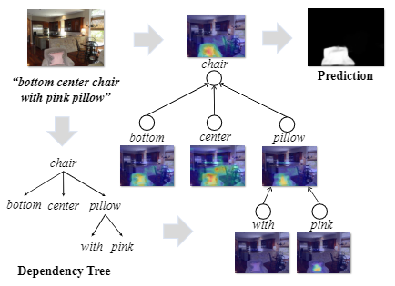

# SANet-TMM


**Structured Attention Network for Referring Image Segmentation** <br />
Liang Lin, Pengxiang Yan, Xiaoqian Xu, Sibei Yang, Kun Zeng, Guanbin Li <br />
IEEE Transactions on Multimedia (TMM), 2021. <br />
[[Paper](https://ieeexplore.ieee.org/abstract/document/9408401)] <br />

## Install

This code is tested on Ubuntu 16.04, with Python=3.7 (via Anaconda3), PyTorch=1.1.0, CUDA=9.0.

```
# Install Dependencies
$ conda install numpy cython
$ pip install opencv-python tqdm nltk scipy tensorboardX requests

# Install ReferIt loader library
$ pip install git+https://github.com/andfoy/refer.git

# Install **Pytorch-1.1**
$ conda install pytorch=1.1.0 torchvision=0.3.0 cudatoolkit=9.0 -c pytorch

# Install **Apex**
$ git clone https://github.com/NVIDIA/apex
$ cd apex
$ git checkout f3a960f80244cf9e80558ab30f7f7e8cbf03c0a0
$ pip install -v --no-cache-dir --global-option="--cpp_ext" --global-option="--cuda_ext" ./
# (or) python setup.py install --cpp_ext --cuda_ext
```

## Datasets
### Download

Download and prepare the datasets UNC, UNC+, G-Ref, and Referit according to https://github.com/BCV-Uniandes/DMS. And put them in `data/rerfer` folder.

### Process
This code relies on depdency parsing tree and glove pretrained word embedding. You can download the processed data of dependency parsing tree and glove wordembedding and put them in `data` folder. [[Google Drive](https://drive.google.com/drive/folders/1FhrP_TNNaiWAPCW0uyFTokz6HRJBNfyA?usp=sharing)] [[Baidu Pan](https://pan.baidu.com/s/1EPo82LOJXvwvxI7zZgMXMA)] (passwd: ic1n)

Or follow the instructions below to process the datasets.
#### Generate dependency parsing tree
Run [stanford corenlp server](https://stanfordnlp.github.io/CoreNLP/) for dependency tree parsing and process the datasets using the following scrips:
```
$ java -mx4g -cp "*" edu.stanford.nlp.pipeline.StanfordCoreNLPServer -port 9000 -timeout 15000
```
```
# Process datasets
# UNC
$ python process_datasets.py --data path/to/dataset --dataset unc --split-root data --parser-url http://localhost:9000
# UNC+
$ python process_datasets.py --data path/to/dataset --dataset unc+ --split-root data --parser-url http://localhost:9000
# G-Ref
$ python process_datasets.py --data path/to/dataset --dataset gref --split-root data --parser-url http://localhost:9000
# referit
$ python process_datasets.py --data path/to/dataset --dataset referit --split-root data --parser-url http://localhost:9000
```
#### Obtain glove pretrained word embedding
Download the [glove pretrained word embedding](https://nlp.stanford.edu/projects/glove/) and process the datasets using the following scripts:
```
# UNC
$ python process_embedding.py -d unc
# UNC+
$ python process_embedding.py -d unc+
# G-Ref
$ python process_embedding.py -d unc+
# referit
$ python process_embedding.py -d referit
```

## Training
```
# train sanet-dpn92
$ sh train_dpn92.sh

# train sanet-resnet101
$ sh train_resnet101.sh
```
Remenber to modify the dataset path, the dataset name, and the subset in the script. And modify the batch size size according to your GPU memory. 

## Testing
Download the trained model weights: [[Google Drive](https://drive.google.com/drive/folders/1cFW44mfUlPvR25N-v0-j2eO5DFEEiqTc?usp=sharing)] [[Baidu Pan](https://pan.baidu.com/s/1s3KC0XQ53IWwPQSw84qogw)] (passwd: i87v)
```
# test sanet-dpn92
$ sh test_dpn92.sh

# test sanet-resnet101
$ sh test_resnet101.sh
```
Remenber to modify the dataset path, its dataset name, the subset, and its trained model path in the script.
### Results
| Method | Backbone           | UNC-val | UNC-testA | UNC-testB | UNC+-val | UNC+-testA | UNC+-testB | G-Ref-val | ReferIt-test |
|--------|--------------------|---------|-----------|-----------|----------|------------|------------|-----------|--------------|
| SANet  | [DPN92(imagenet)](http://data.lip6.fr/cadene/pretrainedmodels/dpn92_extra-b040e4a9b.pth)    | 62.36   | 65.72     | 57.62     | 50.18    | 54.87      | 43.00      | 42.06     | 65.62        |
| SANet  | [DResNet101(vocseg)](https://drive.google.com/u/0/uc?id=1NwcwlWqA-0HqAPk3dSNNPipGMF0iS0Zu&export=download) | 61.84   | 64.95     | 57.43     | 50.38    | 55.36      | 42.74      | 44.53     | 65.88        |

Note that the results of UNC and UNC+ are obtained under the optimal thresholds of their validation sets.

## Citation
If you find this work helpful, please consider citing
```
@article{lin2021structured,
  title={Structured Attention Network for Referring Image Segmentation},
  author={Lin, Liang and Yan, Pengxiang and Xu, Xiaoqian and Yang, Sibei and Zeng, Kun and Li, Guanbin},
  journal={IEEE Transactions on Multimedia},
  year={2021},
  publisher={IEEE}
}
```
